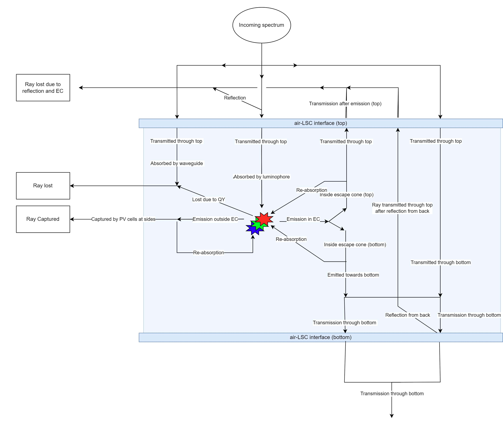

> Numerical algorithm for calculating key performance indicators for luminescent solar concentrators (LSC). 

# Algorithm overview

This algorithm is first presented in [1] and then improved upon in [2]. Be sure to check out those papers for the full documentation and validation. This algorithm calculates key performance indicators based on path probabilities as given by the Lamber-Beer law, the Fresnel equations, and the algorithm by Sychugov [3].

The calculated performance indicators are power conversion efficiency (based on the extended one-diode equation), average visible transmission, and color rendering index (Duv (CIE1960)). The figure below shows the diagram with all the possible paths a ray can take through an LSC that are incorporated in the algorithm. It shows three types of luminophores, the maximum amount the algorithm can handle. 



# Algorithm example

Below the example.py file is given. This shows a possible implementation of the algorithm. 

```python
# Import the wrapper class
from algorithm.algorithm_class import AllAlgorithmsClass

# Initialize the algorithm
numerical_algorithm = AllAlgorithmsClass()

# Run the test to ensure correct implementation
numerical_algorithm.test_all_numerical()

#%% Single LSC

# Create an instance of the wrapper class. See the class or the documentation for all possible parameters. 
algorithm_instance = AllAlgorithmsClass(
    spectrum_start=300,  # Change starting wavelength to 300 nm
    spectrum_end=1400,   # Change ending wavelength to 1400 nm
    width=5.0,           # Change width to 5.0 cm
    height=10.0,         # Change height to 10.0 cm Note: height should always be larger than width. 
    quantum_yield_unity=True  # Set quantum yield to unity
)

luminophore = "Lee et al., 2023_AIGS"
concentration = 30

# Run the algorithm for the single LSC with one luminophore.
pce, avt, cri = algorithm_instance.numerical_single_wrapper(luminophore, concentration)

# Note, results will be different than the test_all_numerical() due to change in default parameters. 
print(pce, avt, cri)
```

# Install

Download or clone the GitHub repo. 

# Features

The algorithm can handle the following LSC configurations:

* Single LSC
* Tandem LSC
* Triple layer LSC
* Two luminophores in one LSC
* Three luminophores in one LSC


These configurations can be implemented with the following parameters:


* Start of light spectrum (wavelength in nanometers)
* End of light spectrum (wavelength in nanometers)
* Spectrum interval (wavelength in nanometers)
* LSC width (cm)
* LSC height (cm) (Should be larger than width)
* LSC thickness (cm)
* Refractive index waveguide
* Refractive index air
* Quantum yield unity (True/False) (Sets the QY of the luminophore(s) to 1.0)
* Waveguide absorption off (True/False) (Ignores absorption by the waveguide)
    
# Data

The Data folder contains all the luminophore data as presented in excel_files/Luminophore.xlsx and Ref. [2]. These are the luminophores that can be simulated directly. Other luminophores should be implemented using the same format.

# Tests

The excel files in the excel_files folder can serve as a testing device. Furthermore, the algorithm contains the test_all_numerical function that tests all results to predetermined values as found in the Excel files. 

# Dependencies

* python >= 3.7.2
* numpy
* pandas
* scipy
* math
* matplotlib

# References

[1] Thomas A. de Bruin and Wilfried G. J. H. M. Van Sark. Numerical Method for Calculation of
Power Conversion Efficiency and Colorimetrics of Rectangular Luminescent Solar Concentrators.
Solar RRL, page 2200787, January 2023. ISSN 2367-198X, 2367-198X. doi: 10.1002/solr.202200787.
URL https://onlinelibrary.wiley.com/doi/10.1002/solr.202200787.

[2] CITATION FORTHCOMING AFTER PUBLICATION.

[3] Ilya Sychugov, "Analytical description of a luminescent solar concentrator," Optica 6, 1046-1049 (2019)
